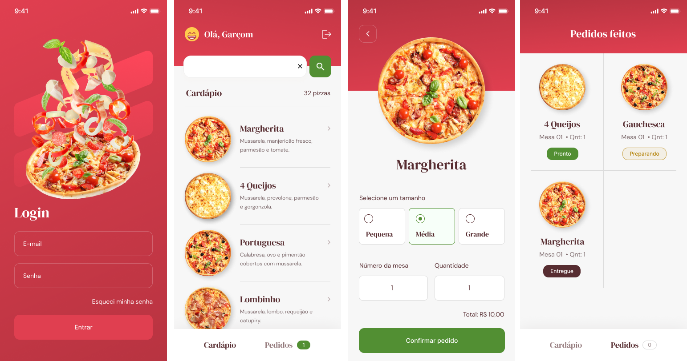
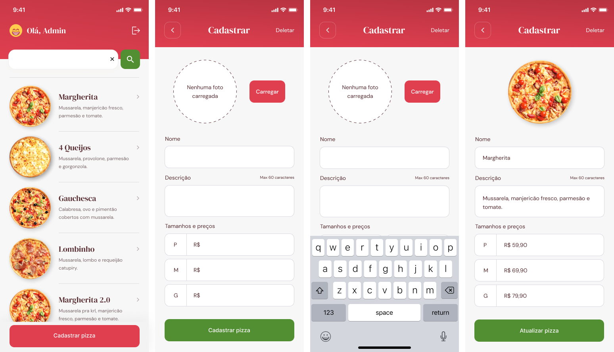

# GoPizza - Application for ordering pizza in a restaurant (waiter and kitchen).

This project was developed during the React Native track, available on Rocketseat's Ignite.

## Table of contents

- [Overview](#overview)
  - [The project](#the-project)
  - [Screenshot](#screenshot)
- [Development process](#development-process)
  - [Built with](#built-with)
- [Coded by](#coded-by)
- [How to run the project](#how-to-run-the-project)

## Overview

### The project

Users should be able to:

- Create an account and login
- Register new pizzas
- List pizza menu
- Make a wish
- Order management

### Screenshot

## Development process

### Built with

- React Native
- Expo
- Firebase
- Async Storage
- Image Picker

## Coded by

- Website - [Daniel Mafra](https://danielmafra.github.io)
- LinkedIn - [@danielmafradev](https://linkedin.com/in/danielmafradev)
- Instagram - [@danielmafradev](https://instagram.com/danielmafradev)

## How to run the project

Clone the repository using "git clone". After that, go to the project folder and use the command "npm install" or "yarn install" to install the dependencies.

Create a Firebase project and download the json file as instructed on the page.

Finally use the command "npm run android" or "yarn android" to start the project (remember to have the emulator or device connected or to use the appropriate command for iOS).
